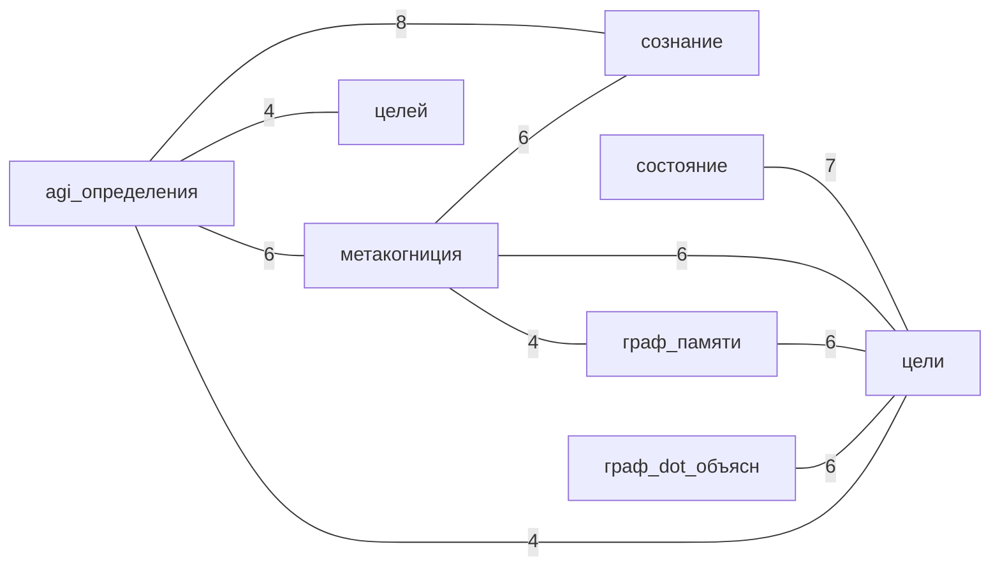

```mermaid
graph LR
  agi_определения ---|8| сознание
  состояние ---|7| цели
  метакогниция ---|6| цели
  метакогниция ---|6| сознание
  agi_определения ---|6| метакогниция
  граф_памяти ---|6| цели
  граф_dot_объясн ---|6| цели
  метакогниция ---|4| граф_памяти
  agi_определения ---|4| цели
  agi_определения ---|4| целей
```

# Интерактивный граф памяти (Mermaid)

Дата: 2026-08-02T00:48:52.938115
Веса = частота совместного чтения в авто-отчетах. Чем толще связь, тем чаще файлы читались вместе агентом.

Всего пар: 10
